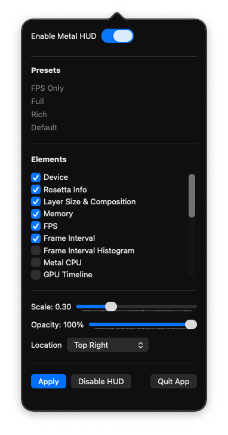

# MetalHUDmenu

A tiny macOS utility that configures Apple’s **Metal Performance HUD** system-wide. Toggle the HUD, pick elements (FPS, GPU time, memory, etc.), set opacity/scale, and place it on screen—without having to triple-click the HUD in-game.

---

## Features
- Enable/disable the Metal HUD
- Choose elements (e.g., FPS, GPU time, memory, thermal)
- Adjust **opacity** and **scale**
- Set **alignment** (top/center/bottom, left/center/right)
- “Set & forget” for all apps (newly launched apps inherit the settings)

## Requirements
- macOS 26 (Tahoe)

## Install
- Download the release `.zip`, extract, then:
  -  Right-click the app → **Open** → Error message will pop up, allow through System Settings > Privacy and security and hit allow at the bottom. 
## Usage
1. Open **MetalHUDmenu**.
2. Toggle **Enable Metal HUD**.
3. Pick HUD **Elements**, set **Opacity** and **Scale**.
4. Choose **Alignment**.
5. Click **Apply**

> Tip: HUD settings are applied via environment variables and affect **newly launched** processes.

> All created with GPT5. 
